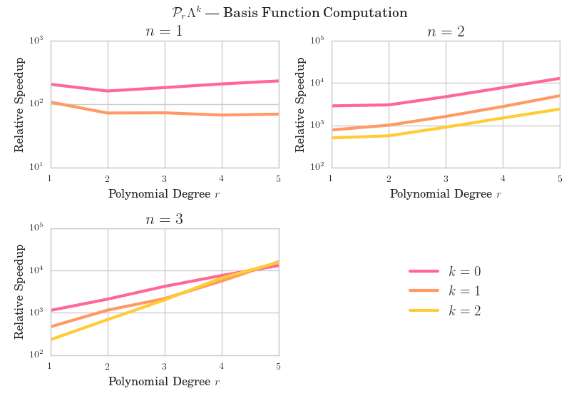
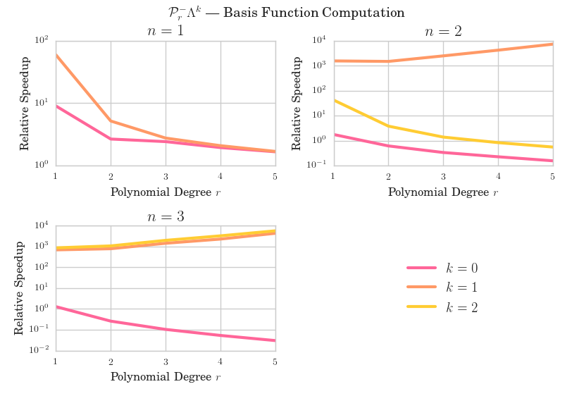

name:title
class: center, middle

template: title

# FEECa: Finite Element Exterior Calculus in Haskell

### Irene Lobo Valbuena, .underline[Simon Pfreundschuh]
### Anders Logg, Patrik Jansson, Mary Sheeran


---
layout: true
class: left

.bottom-image[]

---
## What is FEECa?

- **F**inite **E**lement **E**xterior **Ca**lculus in Haskell
- Implementation of finite element exterior calculus as introduced
  by Arnold, Falk, Winther .superscript[1]
- Differential form calculator
- Support for arbitrary dimensions
- Basis function generator

.footnote[.superscript[1]
Douglas N. Arnold and Richard S. Falk and Ragnar Winther,
*Finite element exterior calculus, homological techniques, and applications*,
Cambridge University Press (2006)
]

---

## Current Status

background-image: url(./periodic_table_1.png)

---

background-image: url(./periodic_table_2.png)

---
class: left, top

## An Example &mdash; $\mathcal{P}_1^-\Lambda^2(\Delta_3)$

.right-column-30[
.center[

]
]

.left-column-70[
- $\mathcal{P}_1^-\Lambda^2 = \mathcal{P}_0 \Lambda^2 + \kappa \mathcal{P}_0 \Lambda^3$
- Just the Whitney forms associated with the faces of simplex

.codebox[
```nohighlight
 λ> let t = referenceSimplex 3
 λ> basis (PrmLk 1 2 t)
 λ> [
    (1.0 λ₀) dλ₁ ∧ dλ₂ + (-1.0 λ₁) dλ₀ ∧ dλ₂ + (1.0 λ₂) dλ₀ ∧ dλ₁,
    (1.0 λ₀) dλ₁ ∧ dλ₃ + (-1.0 λ₁) dλ₀ ∧ dλ₃ + (1.0 λ₃) dλ₀ ∧ dλ₁,
    (1.0 λ₀) dλ₂ ∧ dλ₃ + (-1.0 λ₂) dλ₀ ∧ dλ₃ + (1.0 λ₃) dλ₀ ∧ dλ₂,
    (1.0 λ₁) dλ₂ ∧ dλ₃ + (-1.0 λ₂) dλ₁ ∧ dλ₃ + (1.0 λ₃) dλ₁ ∧ dλ₂]
```
]
]

???

- Nedelec elements of the first kind in three dimensions
- Using a Haskell interactive interpreter
- Whitney forms associated to the faces of the simplex

---

.left-column-40[
## Why Haskell?
]

???

- Primary aim: Explore the potential of Haskell to develop
  mathematical software
- Indeed provides some very nice features.

---

.left-column-40[
## Why Haskell?

- Code close(r) to mathematical notation

]


???

- Functional and high-level language
- Encourages clear and concise code

--

.right-column-60[
## Example

Integrate differential forms over faces of a simplex:

$$ \int_{f} d\omega, \quad f \in \partial \Delta $$

.codebox[
```nohighlight
 λ> let t = referenceSimplex 5
 λ> let omega = whitneyForm t [0,1,2,3,4]
 λ> [integrate f omega | f <- faces t]
 [0.0,0.0,0.0,0.0,0.0,4.1666666666666664e-2]
```
]
]

---

.left-column-40[
## Why Haskell?
- Code close(r) to mathematical notation
- Powerful abstraction mechanisms
]

--

.right-column-60[

## Example

**Parametrized types** can be used to define generic
data structures:

```haskell
data Term a = Constant a
            | Term a MI.MultiIndex

data Polynomial a = Polynomial { degree :: Int,
                                 terms  :: [Term a] }
```
]

--

.right-column-60[
Using **type classes** one can then define generic functions on those
types:

```haskell
class (Ring (Scalar v)) => VectorSpace v where
  type Scalar v :: *
  addV  :: v -> v -> v
  sclV  :: Scalar v -> v -> v
```

```haskell
  subV :: VectorSpace v => v -> v -> v
  subV v1 v2 = addV v1 (sclV (addInv mulId) v2)
```
]

---
.left-column-40[
## Why Haskell?
- Code close(r) to mathematical notation
- Powerful abstraction mechanisms
- Good testing support
]

--

.right-column-60[

**Type classes** can be used to fomulate generic test cases:

.smallcode[
```haskell
product_rule :: (EuclideanSpace v, r ~ Scalar v) =>
                v -> v -> Polynomial r -> Polynomial r -> Bool
product_rule v w p q =
     evaluate v (add (mul p (dw q)) (mul (dw p) q))
  == evaluate v (dw (mul p q))
  where dw = derive w
```
]
]

--

.right-column-60[

Which can then be easily instantiated for concrete number types

```haskell
product_rule_double :: Vector Double
                    -> Vector Double
                    -> Polynomial Double
                    -> Polynomial Double
                    -> Bool
product_rule_double = product_rule

```
.codebox[
```nohighlight
 λ> quickCheck product_rule_double
 *** Failed! Falsifiable (after 2 tests): [...]
```
]
]

---


.left-column-40[
## Why Haskell?
- Code close(r) to mathematical notation
- Powerful abstraction mechanisms
- Good testing support
]

.right-column-60[

**Type classes** can be used to fomulate generic test cases:

.smallcode[
```haskell
product_rule :: (EuclideanSpace v, r ~ Scalar v) =>
                v -> v -> Polynomial r -> Polynomial r -> Bool
product_rule v w p q =
     evaluate v (add (mul p (dw q)) (mul (dw p) q))
  == evaluate v (dw (mul p q))
  where dw = derive w
```
]

]

.right-column-60[

Which can then be easily instantiated for concrete number types

```haskell
product_rule_rational :: Vector Rational
                      -> Vector Rational
                      -> Polynomial Rational
                      -> Polynomial Rational
                      -> Bool
product_rule_rational = product_rule
```
.codebox[
```nohighlight
 λ> quickCheck product_rule_rational
 +++ OK, passed 100 tests.
```
]
]

---
## Finite Element Bases
- FEECa can compute bases for the spaces
    $\mathcal{P}_{r} \Lambda^k (\Delta_n) $,
  $\mathcal{P}_r^-\Lambda^k(\Delta_n)$ for arbitrary $k$,$n$,$r$
- Implementation based on the geometric decomposition proposed by
  Arnold, Falk, Winther .superscript[1]

.footnote[
.superscript[1]
 Douglas N Arnold, Richard S. Falk, and Ragnar Winther.
 *Geometric Decompositions and Local Bases for Spaces of Finite Element Differential Forms*
]

--
### Benchmarks

- Generation of basis functions for $\mathcal{P}_r \Lambda^k(\Delta_3)$ and
  $\mathcal{P}_r^- \Lambda^k(\Delta_3)$ for $k = 0,\ldots,3$ and $r=0,\ldots,5$
- Good performance for basis form computation


---

.imagebox[

]

---

.imagebox[

]

---
class: middle, center
layout: false

# Thank you!

